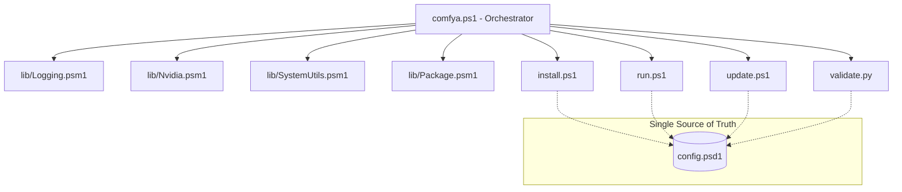

# Architecture comfYa v0.2.0 (Pinnacle)

## Modern Modular Orchestrator

comfYa has evolved from a simple script collection into a high-performance modular orchestrator designed for absolute consistency and peak hardware utilization.

### Structural Overview

### Core Principles

1.  **SSA (Single Source of Truth)**: No hardcoded version mappings. If `config.psd1` says CUDA 12.8, the entire stack (PowerShell & Python) respects it.
2.  **Domain Isolation**: GPU logic is isolated from OS logic, which is isolated from logging. This ensures "Pro" grade maintainability.
3.  **Proactive DX (Developer Experience)**:
    - **Smart Launcher**: Automatically detects VRAM to select the best performance profile.
    - **Self-Healing**: `doctor` command can reconstruct environments and fix common dependency failures.
4.  **Security Hardened**: Downloads are verified via SHA256 hashes, and TLS 1.3 is enforced by default.

---

### Module Responsibilities

| Module | Responsibility | Key Features |
| :--- | :--- | :--- |
| **Nvidia.psm1** | Hardware Intel | CC Detection, Driver-to-CUDA Mapping |
| **Logging.psm1** | Truth Stream | Structured ANSI output, Automated Log Rotation |
| **SystemUtils.psm1** | Environment | Pre-flight checks, Secure Downloads, Registry |
| **Package.psm1** | Dependency Mgmt | Side-loading `uv`, `git` and binary redistributables |

---

## Performance Stack (SOTA)

-   **PyTorch Nightly**: Direct access to inductive optimizations.
-   **Triton-Windows**: JIT-compiled attention kernels.
-   **SageAttention 2.1**: Dynamic wheel injection for Ada/Blackwell architectures.