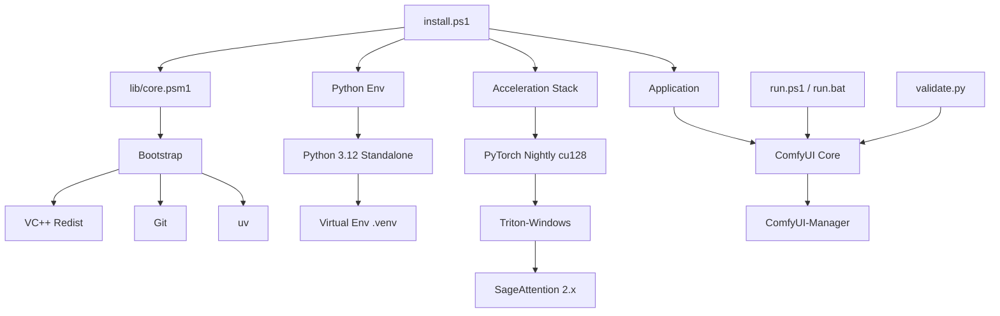

# Architecture comfYa

## Quick Reference (2025-2026)

- **OS**: Windows 10/11
- **Python**: 3.12 (Strictly enforced)
- **Engine**: PyTorch Nightly (cu128/cu124)
- **Backend**: Triton-windows + SageAttention 2.x
- **Manager**: uv (Astral)

---

## Technical Overview

comfYa is a professional-grade orchestrator for ComfyUI. Unlike standard installers, it targets peak performance (SOTA) by leveraging cutting-edge kernels and lightweight environment management.

### System Components

### 1. Environment Management (uv)

comfYa uses **uv** (written in Rust) instead of pip/conda.
- **Speed**: 10-100x faster resolution.
- **Isolation**: Standalone Python versions managed per-project.
- **Deduplication**: Hard-links for shared packages across instances.

### 2. The Acceleration Stack (SOTA)

- **PyTorch Nightly**: Provides experimental support for CUDA 12.8 and latest inductive compiler optimizations.
- **Triton-Windows**: Enables JIT compilation of GPU kernels on Windows (previously Linux-only).
- **SageAttention**: Most advanced attention implementation for RTX 40/50 series, offering up to 40% speedup over FlashAttention-2.

### 3. Deployment Strategy

1. **Phase 1: Bootstrap** (Admin): Prepares system tools.
2. **Phase 2: Environment** (User): Isolated Python 3.12 setup.
3. **Phase 3: Core Packages**: CUDA-aware installation of torch/triton.
4. **Phase 4: Optimization**: Binary wheel injection for SageAttention.
5. **Phase 5: Finalization**: Environment variable sync and validation.

### 4. Configuration Architecture

Centralized in `config.psd1` (PowerShell Data File):
- All URLs, version mappings, and launch arguments are isolated from code.
- Supports environment variable overrides (`COMFYUI_HOME`, etc.).

---

## Design Decisions Rationale

- **Python 3.12**: Chosen for stability and wheel availability (3.13 is still missing critical binary wheels like `sentencepiece`).
- **Nightly Builds**: Necessary to access real-time optimizations for new architectures like Blackwell (RTX 50xx).
- **PowerShell 5.1/7**: Native choice for Windows automation with robust registry and environment management.