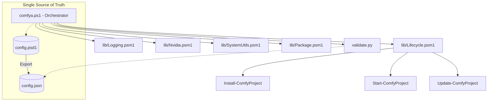

# Architecture comfYa v0.2.5

## Modern Modular Orchestrator

comfYa has evolved from a simple script collection into a high-performance modular orchestrator designed for absolute consistency and peak hardware utilization.

### Structural Overview

### Core Principles

1.  **SSA (Single Source of Truth)**: No hardcoded version mappings. If `config.psd1` says CUDA 12.8, the entire stack (PowerShell & Python) respects it. Includes a **Recursive Placeholder Engine** (`{Dir:Key}`) for zero-redundancy pathing. Schema version in config enables future migration checks.
2.  **Domain Isolation**: GPU logic is isolated from OS logic, which is isolated from logging. This ensures "Pro" grade maintainability.
3.  **Proactive Developer Experience**:
    - **Smart Launcher**: Automatically detects VRAM and identifies the optimal GPU on multi-GPU systems.
    - **Self-Healing Diagnostics**: The `doctor` command performs comprehensive environment audits and provides automated repair options.
4.  **Hardware Invariance**: Detection logic is locale-independent, ensuring accurate numeric parsing across diverse international Windows configurations.
5.  **Security Integration**: Downloads are verified against SHA256 hashes, and modern TLS protocols are enforced for all secure communication.
6.  **Dynamic Dependency Discovery**: Implementation of automated asset resolution via GitHub API to ensure access to optimized backend components.
7.  **Managed Initialization**: Phased startup sequence including sandbox logging to capture early-stage events before administrative elevation.

---

### Module Responsibilities

| Module | Responsibility | Key Features |
| :--- | :--- | :--- |
| **Nvidia.psm1** | Hardware Intel | Robust CC Parsing (Locale-Invariant), Multi-GPU Auto-selection |
| **Logging.psm1** | Truth Stream | Structured ANSI output, SOTA Terminal Detection |
| **SystemUtils.psm1** | Core Utilities | Recursive Placeholder Engine, Environment Syncing, Secure Downloads |
| **Package.psm1** | Dependency Mgmt | Side-loading `uv`, `git` and binary redistributables |
| **Lifecycle.psm1** | Lifecycle Logic | Centralized Directory Init, Installation & Update Orchestration |

---

## Performance Stack (SOTA)

-   **PyTorch Nightly**: Direct access to inductive optimizations.
-   **Triton-Windows**: JIT-compiled attention kernels.
-   **SageAttention 2.2**: Dynamic wheel injection for Ada/Blackwell architectures.